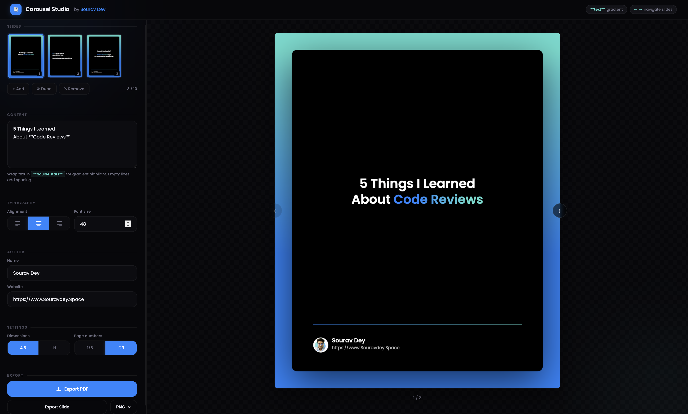

# Carousel Studio

A sleek, browser-based LinkedIn carousel post creator with live canvas preview, multi-slide management, and one-click PDF export. Built with vanilla HTML, CSS, and Canvas API — zero dependencies, zero build step.

  



---

## What It Does

Carousel Studio lets you design professional LinkedIn carousel posts — directly in your browser. Add slides, write your content, tweak typography, and export as a PDF ready to upload to LinkedIn.

**Perfect for:** content creators, dev advocates, personal branding, thought leadership, and anyone building an audience on LinkedIn.

---

## Features

- **Multi-Slide Editor** — create 2 to 10 slides with a visual thumbnail strip
- **Live Canvas Preview** — see every change rendered in real-time on a 1080x1350 canvas
- **Gradient Text** — wrap any text in `**double stars**` and it renders with a blue-to-teal gradient
- **Slide Types** — Cover, Content, and Closing slides with automatic author footer placement
- **Text Alignment** — left, center, or right alignment with icon toggle buttons
- **Font Size Control** — adjustable from 18px to 80px per slide
- **Author Footer** — editable name + website with circular avatar on cover and closing slides
- **Page Numbers** — optional slide counter (01 / 05) with toggle
- **Dimension Toggle** — switch between 4:5 portrait (1080x1350) and 1:1 square (1080x1080)
- **PDF Export** — all slides combined into a single PDF for LinkedIn carousel upload
- **Slide Export** — download individual slides as PNG or JPG
- **Keyboard Navigation** — arrow keys to navigate between slides
- **Responsive Layout** — editor panel + live preview side-by-side on desktop, stacked on mobile

---

## Slide Anatomy

```
┌──────────────────────────────────┐
│  ┌────────────────────────────┐  │
│  │                    01 / 05 │  │  <- Page indicator
│  │                            │  │
│  │   5 Things I Learned       │  │  <- Editable text with
│  │   About **Code Reviews**   │  │     gradient syntax
│  │                            │  │
│  │  ───────────────────────── │  │  <- Gradient divider
│  │  (avatar) Sourav Dey       │  │     (cover + closing only)
│  │           souravdey.space  │  │  <- Author footer
│  └────────────────────────────┘  │
│         Blue -> Teal gradient BG │
└──────────────────────────────────┘
```

---

## Getting Started

No install, no build, no dependencies.

```bash
# Clone the repo
git clone https://github.com/Souravdey777/carousel-studio.git

# Open it
open index.html
```

Or just drag `index.html` into your browser. That's it.

---

## Tech Stack

| Layer | Technology |
|-------|-----------|
| Rendering | HTML5 Canvas API |
| Styling | Vanilla CSS with custom properties |
| Typography | Google Fonts (Poppins) |
| PDF Export | jsPDF (CDN) |
| Image Export | `canvas.toDataURL()` for JPG/PNG |
| Avatar | Base64-embedded PNG (no external requests) |

**Single runtime dependency** (jsPDF via CDN for PDF generation). The entire app is a single self-contained HTML file.

---

## Architecture

```
index.html (single file)
├── CSS
│   ├── Design tokens (CSS variables)
│   ├── Layout (header, panel, preview grid)
│   ├── Components (inputs, buttons, thumbnails, nav arrows, toast)
│   └── Animations (ambient orbs, entrance transitions)
├── HTML
│   ├── Editor panel (slides, textarea, controls, export)
│   └── Live preview (canvas + navigation)
└── JavaScript
    ├── State management (slides array + shared config)
    ├── Canvas renderer (drawSlide function)
    ├── Text parser (**gradient** syntax)
    ├── Slide management (add, duplicate, remove, navigate)
    ├── Thumbnail renderer (scaled mini-canvas per slide)
    ├── Layout engine (dynamic constants for portrait/square)
    ├── PDF export (jsPDF + offscreen canvas loop)
    └── UI interactions (dropdowns, segmented controls, toast)
```

Key design decisions:
- **Single `drawSlide()` function** renders any slide to any canvas context — preview, thumbnails, and export share the exact same code path
- **Dynamic layout via `getLayout()`** — switching between portrait and square recalculates all constants from a single function
- **Config-driven rendering** — slide type (`cover`/`content`/`closing`) controls which elements are drawn (footer, page numbers)

---

## Gradient Text Syntax

Wrap any word or phrase in double asterisks to apply the signature blue-to-teal gradient:

```
Build solutions, not just **code**.
```

Renders as: "Build solutions, not just" in white + "code." in gradient.

Multiple gradient segments per line are supported:

```
**Great engineers** write **great tests**.
```

---

## Export Formats

| Format | Use Case | How |
|--------|----------|-----|
| **PDF** | LinkedIn carousel upload | All slides rendered to jsPDF at full resolution |
| **PNG** | Individual slide sharing | Current slide rasterized at 1080px |
| **JPG** | Lightweight sharing | Current slide rasterized at 1080px, 95% quality |

All exports are client-side — nothing is uploaded to any server.

---

## Customization

### Changing the avatar

Replace the base64 data URL in the `AVATAR` constant with your own.

### Changing the colors

Edit the `C` object in the script:

```javascript
const C = {
  w: '#FFFFFF',      // Text color
  url: '#bbbbbb',    // URL color
  blue: '#1C86FF',   // Primary gradient stop
  teal: '#5ADDCF',   // Secondary gradient stop
  card: '#000000'    // Card background
};
```

### Changing the default slides

Edit the `state.slides` array to customize the starting content for new users.

---

## Browser Support

Works in all modern browsers that support Canvas API and CSS custom properties:

- Chrome 80+
- Firefox 78+
- Safari 14+
- Edge 80+

---

## License

MIT — use it, fork it, make it yours.

---

## Author

**Sourav Dey**
Senior Frontend Engineer

[Souravdey.space](https://Souravdey.space)

---

<p align="center">
  <sub>Built with vanilla JavaScript</sub>
</p>
